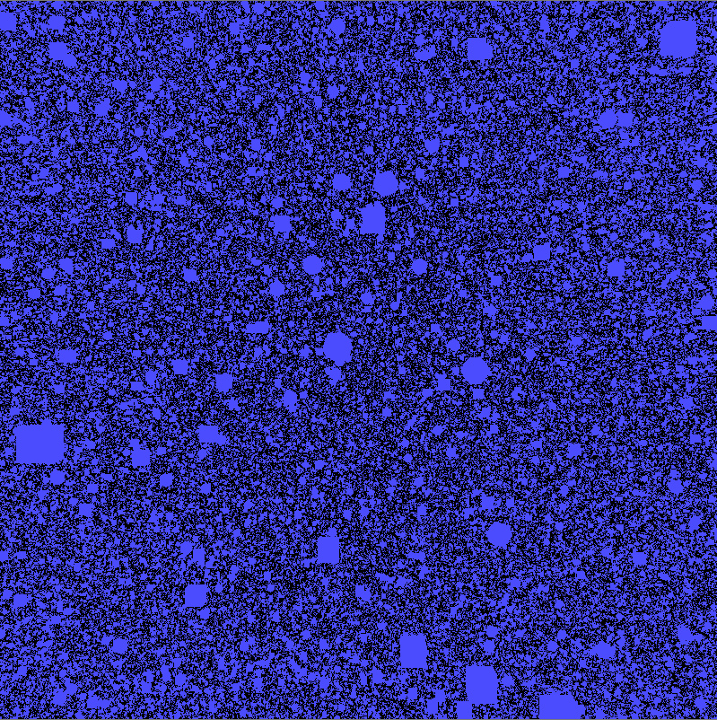

# Mass Instancing

## Notes

This project sets out to draw many instances while avoiding costly CPU-GPU synchronization. One of the key features is glMultiDrawElementsIndirectAMD, which uses buffer data to source instanced drawing of any number of shapes.

Because the draw command is in buffer data, this means we can modify aspects of the draw call from the server side. The most important parameter for this demo is primCount, which specifies the number of instances to draw for that shape. The scene may hold 1 million things, but clearly it would be very inefficient to set paramCount to 1000000 and draw everything. So what we need to do is modify primCount based on how many objects are actually in view, which is done with frustum culling.

I use OpenCL to cull instances whose centers are not in the clip space cube. When an instance is in the viewable range, the kernel atomically increments the primCount parameter of the draw indirect command struct. This works because GL and CL both share the buffer object memory for the draw indirect command. Then the translation of that instance is appended to a GL array buffer which feeds the translation attribute of the vertex shader. The translation attribute advances once per instance rather than once per vertex with glVertexAttribDivisor set to 1.

Nearly all of the relevant code is contained within MeshLibrary.cpp and data/culling.cl

This program has been developed on a NVIDIA GTX 460 and requires **OpenGL 4.2 with the GL_AMD_multi_draw_indirect extension**

If you don't feel like building the project, you can run everything.exe and ten_million.exe to see some examples of this project
   
## Build Instructions
 
To build and run for Visual Studio 2010:

* Clone the repo, or just download it
* Rename the root folder so that it doesn't have hyphens (bug in Premake that I will try to address)
* Go to the tools/project_builder folder and run build_win.bat.
* Now navigate to the build folder and open the solution.
* Run in debug or release

## Controls

* Mouse click and drag to look around world
* Mouse wheel to move forward/backwards

## Examples

everything.exe

* 5000 cubes
* 5000 isopheres
* 5000 aliens (14,192 triangles each)
* 5000 pumpkins (30,000 triangles each)

* Shading is done just by the normal.
* Would be more efficient with LOD for the complicated meshes, but I haven't implemented this yet.

ten_million.exe

* 5,000,000 cubes
* 5,000,000 isospheres

